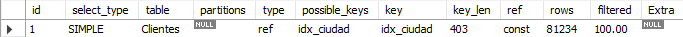
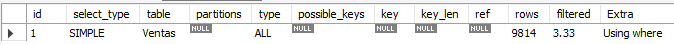
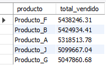
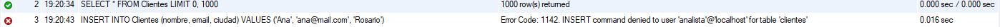
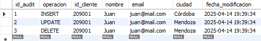

# Fundamentos, Integridad y Concurrencia

## Ejercicio 1:

Reglas de Integridad Dado un modelo de base de datos de una universidad, identificar violaciones posibles a la integridad referencial si se elimina un estudiante con cursos inscritos. ¿Que mecanismos usar ıas para evitarlo?

En el modelo propuesto, si se elimina un estudiante que tiene cursos inscritos, se produciría una violación de la integridad referencial, ya que la tabla Inscripciones contiene claves foráneas que hacen referencia a ese estudiante.
Esto dejaría registros en Inscripciones apuntando a un estudiante inexistente, lo que comprometería la coherencia de los datos.
Para evitar este problema, pueden aplicarse los siguientes mecanismos en la definición de la clave foránea:

- ON DELETE RESTRICT o NO ACTION: Evita la eliminación si existen inscripciones asociadas. Es una opción segura que fuerza al usuario a eliminar primero las inscripciones antes de eliminar al estudiante.
- ON DELETE CASCADE: Elimina automáticamente las inscripciones asociadas al estudiante eliminado. Puede ser útil si se quiere mantener consistencia sin intervención manual.
- ON DELETE SET NULL: Pone en NULL la clave foránea en las inscripciones. No siempre es válido, pero puede aplicarse si la lógica del negocio lo permite.
  En un entorno académico, una opción razonable sería RESTRICT, para evitar la pérdida de información accidental, asegurando que un estudiante solo se elimine si ya no tiene inscripciones activas.

## Ejercicio 2: Implementacion de Restricciones

Crear una tabla Matriculas con restricciones de clave foranea. Luego, insertar datos que violen la integridad y mostrar el error generado.

1. Asumiendo que hay una BBDD se crean las tablas:

```sql
CREATE TABLE Estudiantes (
    id_estudiante INT PRIMARY KEY,
    nombre VARCHAR(100)
);
```

La tabla Matriculas, con una clave foránea que apunta a Estudiantes.id_estudiante:

```sql
CREATE TABLE Matriculas (
    id_matricula INT PRIMARY KEY,
    id_estudiante INT,
    id_curso INT,
    fecha_matricula DATE,
    FOREIGN KEY (id_estudiante) REFERENCES Estudiantes(id_estudiante)
);
```

2. Se prueba insertar una matrícula de un estudiante que no existe.

```sql
INSERT INTO Matriculas (id_matricula, id_estudiante, id_curso, fecha_matricula)
VALUES (1, 999, 101, '2025-04-09');
```

Devolucion en MySQL Workbech:

```
Error Code: 1452. Cannot add or update a child row: a foreign key constraint fails (`universidad`.`matriculas`, CONSTRAINT `matriculas_ibfk_1` FOREIGN KEY (`id_estudiante`) REFERENCES `estudiantes` (`id_estudiante`))
```

Esto demuestra que la restricción de clave foránea está funcionando correctamente, garantizando la consistencia de los datos entre ambas tablas.

## Ejercicio 3: Concurrencia

Simular una situacion donde dos usuarios intentan actualizar el mismo saldo de una cuenta bancaria.
Analizar como afectan las condiciones de aislamiento (READ COMMITTED vs SERIALIZABLE).

### Creacion de la tabla

```sql
CREATE TABLE Cuentas (
    id_cuenta INT PRIMARY KEY,
    titular VARCHAR(100),
    saldo DECIMAL(10,2)
);

-- Insertamos una cuenta con saldo inicial
INSERT INTO Cuentas (id_cuenta, titular, saldo)
VALUES (1, 'Juan Pérez', 1000.00);
```

### Simulación de concurrencia:

Supongamos que dos usuarios (dos sesiones distintas) están accediendo a la misma cuenta para depositar dinero.

Escenario:

- Usuario A quiere sumar $100
- Usuario B quiere sumar $200
- Ambos leen el saldo inicial ($1000), lo actualizan localmente y escriben el nuevo saldo.
- El resultado final dependerá del nivel de aislamiento usado.

### READ COMMITTED

1. Ambas transacciones pueden leer el saldo original (1000)

2. Usuario A suma 100 → actualiza a 1100

3. Usuario B, que también había leído 1000, suma 200 → actualiza a 1200

**Resultado final: $1200**.
Pero se pierde el depósito de A ($100).
Esto es una condición de carrera, llamada _lectura no repetible_ o _actualización perdida_.

### SERIALIZABLE

- La segunda transacción debe esperar a que termine la primera.

- Así se evita que ambas lean el mismo valor al mismo tiempo.

- El resultado final sería $1300, porque primero se suma $100 y después $200.

### Conclusion

En el nivel de aislamiento READ COMMITTED, ambas transacciones leen el mismo saldo inicial, actualizan por separado, y escriben sus propios valores. Esto puede provocar una pérdida de actualización, ya que el segundo usuario sobrescribe el cambio del primero, resultando en un saldo incorrecto.

En cambio, bajo el nivel SERIALIZABLE, el sistema fuerza a que las transacciones se ejecuten de manera completamente aislada: una transacción debe terminar antes de que la otra pueda acceder a la fila afectada. Esto previene las condiciones de carrera, y asegura que el saldo final sea el correcto.

Por lo tanto, aunque SERIALIZABLE implica mayor uso de recursos y bloqueos, garantiza la integridad de los datos en entornos donde la concurrencia puede provocar errores lógicos.

# Optimizacion de Consultas, Indices y Vistas

## Ejercicio 4: Plan de Ejecucion

Usar una base de datos con mas de 100,000 registros. Ejecutar una consulta sin ındice y luego con
ındice. Usar EXPLAIN para comparar rendimiento.

1. Tabla de Ejemplo

```sql
CREATE TABLE Clientes (
    id INT AUTO_INCREMENT PRIMARY KEY,
    nombre VARCHAR(100),
    email VARCHAR(100),
    ciudad VARCHAR(100)
);
```

2. Insertar muchos registros

```sql
DELIMITER $$

CREATE PROCEDURE insertar_clientes()
BEGIN
  DECLARE i INT DEFAULT 1;
  WHILE i <= 100000 DO
    INSERT INTO Clientes (nombre, email, ciudad)
    VALUES (
      CONCAT('Cliente_', i),
      CONCAT('cliente', i, '@mail.com'),
      ELT(FLOOR(1 + (RAND() * 5)), 'Buenos Aires', 'Córdoba', 'Rosario', 'Mendoza', 'La Plata')
    );
    SET i = i + 1;
  END WHILE;
END$$

DELIMITER ;

CALL insertar_clientes();
```

3. Ejecucion sin indice

```sql
EXPLAIN SELECT * FROM Clientes WHERE ciudad = 'Rosario';
```

**Resultado:**


4. Crear un índice

```sql
CREATE INDEX idx_ciudad ON Clientes(ciudad);
```

5. Ejecucion de consulta con indice.

```sql
EXPLAIN SELECT * FROM Clientes WHERE ciudad = 'Rosario';
```

**Resultado:**



### Conclusion

#### Sin índice:

- El plan de ejecución (EXPLAIN) mostró type = ALL, lo que significa un escaneo completo de tabla.

- Se estimó la lectura de mas de 100.000 filas.

#### Con índice:

- Se creó el índice idx_ciudad sobre la columna ciudad.

- El nuevo plan de ejecución mostró type = ref, utilizando el índice creado.

- El número de filas leídas bajó significativamente.

El uso de índices permite que el motor de base de datos acceda directamente a los registros relevantes, reduciendo el tiempo de ejecución y el consumo de recursos.

## Ejercicio 5: Creacion de Indices

Diseñar una consulta que filtre por m ultiples campos. Crear diferentes ındices y medir cual ofrece
mejor rendimiento.

1. Creacion de tabla de ejemplo.

```sql
CREATE TABLE Ventas (
    id INT AUTO_INCREMENT PRIMARY KEY,
    cliente VARCHAR(100),
    producto VARCHAR(100),
    fecha DATE,
    total DECIMAL(10,2)
);
```

Se realiza un Insert masivo para los datos de prueba:

```sql
INSERT INTO Ventas (cliente, producto, fecha, total)
SELECT
    CONCAT('Cliente_', FLOOR(1 + (RAND() * 5000))),           -- 5000 clientes distintos aprox
    CONCAT('Producto_', ELT(FLOOR(1 + (RAND() * 10)), 'A', 'B', 'C', 'D', 'E', 'F', 'G', 'H', 'I', 'J')),
    DATE_ADD('2023-01-01', INTERVAL FLOOR(RAND() * 365) DAY), -- Fechas aleatorias en 2023
    ROUND(RAND() * 10000, 2)                                  -- Valores hasta $10,000
FROM (
    SELECT a.N + b.N * 10 + c.N * 100 + d.N * 1000 AS rownum
    FROM
        (SELECT 0 AS N UNION SELECT 1 UNION SELECT 2 UNION SELECT 3 UNION SELECT 4
         UNION SELECT 5 UNION SELECT 6 UNION SELECT 7 UNION SELECT 8 UNION SELECT 9) a,
        (SELECT 0 AS N UNION SELECT 1 UNION SELECT 2 UNION SELECT 3 UNION SELECT 4
         UNION SELECT 5 UNION SELECT 6 UNION SELECT 7 UNION SELECT 8 UNION SELECT 9) b,
        (SELECT 0 AS N UNION SELECT 1 UNION SELECT 2 UNION SELECT 3 UNION SELECT 4
         UNION SELECT 5 UNION SELECT 6 UNION SELECT 7 UNION SELECT 8 UNION SELECT 9) c,
        (SELECT 0 AS N UNION SELECT 1 UNION SELECT 2 UNION SELECT 3 UNION SELECT 4
         UNION SELECT 5 UNION SELECT 6 UNION SELECT 7 UNION SELECT 8 UNION SELECT 9) d
) AS numbers
LIMIT 100000;
```

2. Consulta a optimizar.
   Se realiza una consula que filtra por 2 campos.

```sql
SELECT * FROM Ventas
WHERE producto = 'Producto_A' AND total < 5000
LIMIT 200
```

3. Caso base: Sin índices

```sql
EXPLAIN SELECT * FROM Ventas
WHERE producto = 'Producto_A' AND total < 5000
LIMIT 200
```



4. Crear distintos índices y comparar.
   Índice solo sobre producto:

```sql
CREATE INDEX idx_producto ON Ventas(producto);
```


## Ejercicio 6: Vistas

Crear una vista que resuma las ventas mensuales por producto. Luego, usarla en una consulta que
devuelva los 5 productos mas vendidos.

### 1- Crear una vista de resumen mensual

```sql
CREATE VIEW resumen_ventas_mensuales AS
SELECT
    producto,
    DATE_FORMAT(fecha, '%Y-%m') AS mes,
    SUM(total) AS total_mensual
FROM Ventas
GROUP BY producto, mes;
```

### 2- Usar la vista para obtener los 5 productos más vendidos

```sql
SELECT
    producto,
    SUM(total_mensual) AS total_vendido
FROM resumen_ventas_mensuales
GROUP BY producto
ORDER BY total_vendido DESC
LIMIT 5;
```

### Resultado



# Administracion, Seguridad y Mantenimiento

## Ejercicio 7: Gestion de Permisos

Crear un usuario analista que solo pueda hacer SELECT en ciertas tablas. Intentar insertar desde
ese usuario y explicar el resultado.

### Paso 1: Crear un nuevo usuario analista

```sql

CREATE USER 'analista'@'localhost' IDENTIFIED BY 'analista123';
```

### Paso 2: Dar permisos de solo lectura (SELECT) sobre algunas tablas

Supongamos que solo le damos acceso a las tablas Clientes y Ventas:

```sql

GRANT SELECT ON tu_base_de_datos.Clientes TO 'analista'@'localhost';
GRANT SELECT ON tu_base_de_datos.Ventas TO 'analista'@'localhost';
```

Reemplazá tu_base_de_datos con el nombre real de tu base.

Para que los cambios se apliquen:

```sql
FLUSH PRIVILEGES;
```

### Probar permisos

Deberia funcionar:

```sql
SELECT * FROM Clientes;
```

Deberia dar error:

```sql
INSERT INTO Clientes (nombre, email, ciudad)
VALUES ('Ana', 'ana@mail.com', 'Rosario');
```

### Resultado



## Ejercicio 8: Seguridad y Auditorıa

Simular una auditorıa simple con triggers que registren toda modificacion en una tabla Clientes.

✅ Objetivo
Registrar toda modificación (INSERT, UPDATE, DELETE) que ocurra en la tabla Clientes, guardando:

Qué operación se hizo

Qué datos se modificaron

Cuándo ocurrió

Y (opcionalmente) quién lo hizo

### 1: Crear tabla Clientes (si no existe)

```sql

CREATE TABLE Clientes (
    id INT AUTO_INCREMENT PRIMARY KEY,
    nombre VARCHAR(100),
    email VARCHAR(100),
    ciudad VARCHAR(100)
);
```

### 2: Crear tabla de auditoría

```sql

CREATE TABLE Auditoria_Clientes (
    id_audit INT AUTO_INCREMENT PRIMARY KEY,
    operacion VARCHAR(10),         -- INSERT, UPDATE o DELETE
    id_cliente INT,
    nombre VARCHAR(100),
    email VARCHAR(100),
    ciudad VARCHAR(100),
    fecha_modificacion DATETIME
);
```

### 3: Crear los TRIGGERS

Trigger para INSERT

```sql

CREATE TRIGGER trg_clientes_insert
AFTER INSERT ON Clientes
FOR EACH ROW
INSERT INTO Auditoria_Clientes (operacion, id_cliente, nombre, email, ciudad, fecha_modificacion)
VALUES ('INSERT', NEW.id, NEW.nombre, NEW.email, NEW.ciudad, NOW());
```

Trigger para UPDATE

```sql

CREATE TRIGGER trg_clientes_update
AFTER UPDATE ON Clientes
FOR EACH ROW
INSERT INTO Auditoria_Clientes (operacion, id_cliente, nombre, email, ciudad, fecha_modificacion)
VALUES ('UPDATE', NEW.id, NEW.nombre, NEW.email, NEW.ciudad, NOW());
```

Trigger para DELETE

```sql

CREATE TRIGGER trg_clientes_delete
AFTER DELETE ON Clientes
FOR EACH ROW
INSERT INTO Auditoria_Clientes (operacion, id_cliente, nombre, email, ciudad, fecha_modificacion)
VALUES ('DELETE', OLD.id, OLD.nombre, OLD.email, OLD.ciudad, NOW());
```

### 4: Probar auditoría

```sql
-- INSERT
INSERT INTO Clientes (nombre, email, ciudad) VALUES ('Juan', 'juan@mail.com', 'Córdoba');

-- UPDATE
UPDATE Clientes SET ciudad = 'Mendoza' WHERE nombre = 'Juan';


-- DELETE
DELETE FROM Clientes WHERE nombre = 'Juan';
```

Y luego consultá la auditoría:

```sql

SELECT * FROM Auditoria_Clientes;
```

### RESUTLADO



## Ejercicio 9: Backup y Restore

Documentar paso a paso como hacer un backup completo en MySQL o PostgreSQL y como restaurarlo. Simular una perdida de datos y su posterior recuperacion.

### PASO 1: Crear un backup completo (dump)

Usamos la herramienta mysqldump (viene con MySQL).

Comando:

```bash
mysqldump -u root -p nombre_base_datos > backup_completo.sql
```

Pedirá la contraseña de root.

Reemplazá nombre_base_datos por el nombre real de la base, por ejemplo: universidad.

Esto genera un archivo .sql con todo: estructura + datos.

### PASO 2: Simular pérdida de datos

Borrar datos de una tabla o directamente borrar la base de datos:

Simulacion de una pérdida total:

```sql
DROP DATABASE universidad;
```

### PASO 3: Restaurar el backup

Primero, crear la base nuevamente.

```sql
CREATE DATABASE universidad;
```

Luego, restaurar con el comando:

```bash
mysql -u root -p universidad < backup_completo.sql
```

Esto va a recrear todas las tablas y registros tal como estaban en el momento del backup.
